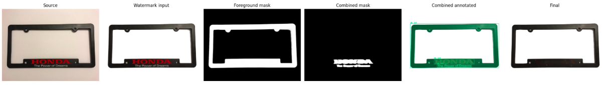

# Watermark Detection, Segmentation, and Inpainting POC

This repository is a set of Google Colab notebooks for evaluating a watermark-removal workflow on product images. The workflow identifies suspected watermark overlays, turns their bounding boxes into pixel masks, and uses image inpainting to produce a cleaned image. The batch notebooks preserve per-image artifacts and reports so detections and removal decisions can be reviewed.

The notebooks are prototypes rather than a packaged application: they contain Colab commands, runtime installation steps, model downloads, and paths that must be adapted for the environment where they are run.

## Overall workflow

The batch pipelines use the following stages:

```text
Product images
  -> optional RMBG background removal and white-background composite
  -> watermark detection (GroundingDINO, YOLO, or both)
  -> SAM 2 pixel segmentation from the detection boxes
  -> optional product-overlap safety gate
  -> LaMa inpainting of the approved mask
  -> per-image artifacts, CSV summaries, and JSON manifests
```

Background removal uses BRIA RMBG to create both a white-background image for the detector/inpainter and a foreground mask of the product. GroundingDINO is prompted with watermark-related text; YOLO uses supplied custom weights. SAM 2 refines either detector's box into a mask. LaMa fills the pixels represented by the final mask.

## Sample results

The images below are end-to-end pipeline previews. Each one shows, from left to right: the source image, watermark-processing input, RMBG foreground mask, combined removal mask, detector annotation, and final inpainted image. They are representative examples for visual review, not accuracy benchmarks.

<p align="center">
  
  <br /><sub>Sample 1</sub>
</p>

<p align="center">
  
  <br /><sub>Sample 2</sub>
</p>

<p align="center">
  
  <br /><sub>Sample 3</sub>
</p>

<p align="center">
  
  <br /><sub>Sample 4</sub>
</p>

<p align="center">
  
  <br /><sub>Sample 5</sub>
</p>

<p align="center">
  
  <br /><sub>Sample 6</sub>
</p>

<p align="center">
  
  <br /><sub>Sample 7</sub>
</p>

## Notebook guide

| Notebook | Objective | Detection approach | Best use |
| --- | --- | --- | --- |
| [`rnd_complete.ipynb`](rnd_complete.ipynb) | R&D and single-image validation of the component models. | GroundingDINO + SAM 2 demo, then OWLv2 classifier + YOLO + SAM 2. | Trying models, weights, prompts, masks, and LaMa on one image before a batch run. |
| [`watermark_batch_rmbg_yolo_sam2_lama.ipynb`](watermark_batch_rmbg_yolo_sam2_lama.ipynb) | Batch processing with a YOLO-based watermark detector. | RMBG, optional OWLv2 clean-image gate, YOLO, SAM 2, and LaMa. | Running the original custom-YOLO batch path. |
| [`watermark_batch_rmbg_grounding_dino_sam2_lama.ipynb`](watermark_batch_rmbg_grounding_dino_sam2_lama.ipynb) | Batch processing with prompt-driven detection rather than custom YOLO weights. | RMBG, GroundingDINO, SAM 2, and LaMa. | Testing whether text-prompted detection generalizes better to new watermark styles. |
| [`watermark_batch_rmbg_grounding_dino_yolo_sam2_lama_safety_gate.ipynb`](watermark_batch_rmbg_grounding_dino_yolo_sam2_lama_safety_gate.ipynb) | Configurable, reviewable batch workflow that combines both detector paths and protects against altering the product. | RMBG, optional GroundingDINO and YOLO, merged SAM 2 masks, safety gate, and LaMa. | The most complete notebook and the recommended starting point for controlled batch evaluation. |

### `rnd_complete.ipynb`: exploratory single-image workflow

This notebook is the proof-of-concept and model-integration workspace. It has three main parts:

1. It installs Grounded-SAM-2, downloads the SAM 2.1 large checkpoint, and runs the Grounded-SAM-2 demo with a text prompt such as `watermark`, `logo`, and `text overlay`. It then decodes the model's RLE segmentations and saves individual and combined PNG masks.
2. It implements a second detector path: an OWLv2-based binary classifier first estimates whether an image is watermarked; a custom YOLO model locates candidate regions; SAM 2 turns those regions into masks. It writes the combined mask, individual masks, an annotated image, and a JSON result file.
3. It installs and runs LaMa. The combined mask is optionally dilated before inpainting, and the notebook displays the original image, mask, and resulting image side by side.

Use this notebook to validate an image path, model checkpoint, custom classifier/YOLO weights, detector prompt, and mask quality. It is not intended for directory-scale processing.

### `watermark_batch_rmbg_yolo_sam2_lama.ipynb`: YOLO batch workflow

This is the first production-oriented batch version of the R&D path. It recursively reads common image formats from category subfolders and mirrors those folders in its output tree. Its pipeline is:

1. Remove the background with `briaai/RMBG-1.4`; save a foreground mask and a white-background product image.
2. Optionally use the OWLv2 classifier as a conservative gate. It only skips the YOLO/SAM stages when the image is confidently clean; by default `RUN_CLASSIFIER_GATE` is disabled.
3. Run custom YOLO watermark detection and pass the detected boxes to SAM 2.
4. Union the SAM masks and send the white-background image plus that mask to LaMa.
5. Copy the white-background input as `final.png` for successful images that have no mask, so every successful record has a final-image path.

Use this notebook when the supplied `yolo11x-train28-best.pt` weights are the preferred detector and you want a simpler detector path.

### `watermark_batch_rmbg_grounding_dino_sam2_lama.ipynb`: GroundingDINO batch workflow

This notebook retains the same directory handling, RMBG preprocessing, SAM 2 segmentation, LaMa inpainting, and reporting layout as the YOLO batch notebook. The difference is the detector: GroundingDINO uses a text prompt (by default, `watermarked text, logo, watermark text overlay.`) to propose boxes, and SAM 2 converts those boxes into masks.

It uses the `IDEA-Research/grounding-dino-tiny` model and exposes box and text thresholds in the configuration cell. Choose this variant to assess prompt-based detection independently of the custom YOLO weights.

### `watermark_batch_rmbg_grounding_dino_yolo_sam2_lama_safety_gate.ipynb`: combined and guarded workflow

This is the most comprehensive notebook. It supports two configured datasets and lets the operator enable or disable background removal, GroundingDINO, YOLO, and LaMa independently. By default it runs both detectors:

1. RMBG produces the white-background watermark input and the product foreground mask.
2. GroundingDINO and/or YOLO generate detections. The optional OWLv2 classifier can only gate the YOLO branch; it never suppresses GroundingDINO.
3. SAM 2 segments detections for each enabled detector. The notebook retains detector-specific outputs and unions their masks into the mask passed to LaMa.
4. The product-overlap safety gate compares each proposed removal mask with the RMBG foreground mask. A detection covering more than `GATE_PER_DETECTION_BLOCK` of the product is dropped. If the surviving union covers more than `GATE_COMBINED_BLOCK`, the image is blocked from LaMa and the untouched watermark input is copied as the final image. Coverage above `GATE_COMBINED_WARN`, but below the block threshold, is processed with a warning.
5. The notebook writes review artifacts, including gate reports, and includes cells to preview gate decisions, export a flattened final-image folder, and recalibrate gate thresholds offline from saved masks.

The default thresholds are based on previous notebook runs and are starting points, not universally safe values. Review `gate_report.csv`, `gate_detections.csv`, annotations, and final images before treating a batch as approved.

## Running a batch notebook

1. Open the selected notebook in Google Colab and use a CUDA-capable runtime. The notebooks can check CUDA availability, but practical batch execution expects GPU memory for RMBG, the detector(s), SAM 2, and LaMa.
2. Run the dependency-installation cells. They clone Grounded-SAM-2, download the SAM 2.1 large checkpoint, install Python packages, and, where needed, clone the watermark-detection weights repository and LaMa.
3. Mount Google Drive if using the included paths. Update the configuration cell before processing:
   - `INPUT_DIR` and `OUTPUT_DIR` for the single-detector notebooks, or `DATASETS` and `ACTIVE_DATASET` for the combined notebook.
   - The local paths to custom YOLO and OWLv2 classifier weights, when their branch is enabled.
   - Detector prompts, confidence thresholds, stage toggles, and LaMa mask-dilation settings.
4. Run the pipeline cells in notebook order, then inspect the preview and the generated reports.

The combined notebook's configuration cell supports two named dataset mappings (`watermarks` and `brand_text_logo`). Change `ACTIVE_DATASET` and re-run that configuration cell before running the batch cell.

## Output layout and traceability

Each batch notebook creates a separate directory for every input image, retaining the input category structure. The exact detector-specific filenames vary by notebook, but the artifact pattern is:

```text
<output>/<category>/<image-id>/
  source_original.png
  background_removed/
    foreground_mask.png
    white_background.png
  masks/
    combined_mask.png
    mask_*.png
  detections/
    pipeline_result.json
    ... detector-specific annotation and result files
  inpainted/
    final.png
    lama_raw_output.png        # when LaMa runs

<output>/summary.csv
<output>/manifest.json
```

`pipeline_result.json` captures the source and generated paths, detector status, detection counts, masks, and errors for an image. The combined notebook additionally produces `gate_report.csv` (one decision per image) and `gate_detections.csv` (one coverage decision per detection). These reports are the primary audit trail for reviewing whether a product may have been modified.

## Technology sources and model provenance

The notebooks use the following primary projects and model sources. Custom weight files referenced only by local Colab paths are called out separately because their training data and origin are not included in this repository.

| Technology | Purpose in this POC | Primary source / model used |
| --- | --- | --- |
| Grounded-SAM-2 | Single-image R&D demo and Colab integration of GroundingDINO with SAM 2. | [IDEA-Research/Grounded-SAM-2](https://github.com/IDEA-Research/Grounded-SAM-2) |
| GroundingDINO | Prompt-driven watermark candidate detection. | [Official GroundingDINO repository](https://github.com/IDEA-Research/GroundingDINO); model cards for [grounding-dino-base](https://huggingface.co/IDEA-Research/grounding-dino-base) and [grounding-dino-tiny](https://huggingface.co/IDEA-Research/grounding-dino-tiny) |
| SAM 2 / SAM 2.1 | Pixel-level segmentation from detector bounding boxes. | [Meta SAM 2 repository and checkpoint instructions](https://github.com/facebookresearch/sam2); the notebooks download the [SAM 2.1 Hiera Large checkpoint](https://dl.fbaipublicfiles.com/segment_anything_2/092824/sam2.1_hiera_large.pt) |
| YOLO11 / Ultralytics | Custom-weight watermark candidate detection. | [Ultralytics YOLO11 documentation](https://docs.ultralytics.com/models/yolo11/) and [Ultralytics source repository](https://github.com/ultralytics/ultralytics) |
| OWLv2 | Optional binary classifier gate for the YOLO path. | [Google OWLv2 base patch-16 ensemble model card](https://huggingface.co/google/owlv2-base-patch16-ensemble) |
| BRIA RMBG 1.4 | Background removal, white-background compositing, and product foreground masks. | [BRIA RMBG-1.4 model card](https://huggingface.co/briaai/RMBG-1.4) |
| LaMa | Inpainting the final, approved watermark mask. | [LaMa source repository](https://github.com/advimman/lama); [Big-LaMa model download used by the notebooks](https://huggingface.co/smartywu/big-lama) |
| PyTorch and Transformers | Runtime, model loading, image tensors, and Hugging Face model APIs. | [PyTorch](https://pytorch.org/) and [Hugging Face Transformers](https://github.com/huggingface/transformers) |

The notebook-specific custom files `yolo11x-train28-best.pt` and `far5y1y5-8000.pt` are referenced from `/content`, but are not included here and have no source URL recorded in the notebooks. Add their training/provenance links before presenting a fully reproducible or externally auditable run. Review each upstream project's license and model terms before use.

## Important operational notes

- Treat detection and inpainting results as candidates for human review. A detector can mistake product branding, text, or the entire product for a watermark.
- GroundingDINO prompt wording materially affects false positives. The combined notebook explicitly warns that broad terms can create whole-product detections.
- The custom YOLO and OWLv2 weight files are referenced by Colab paths but are not stored in this repository. Supply accessible copies before enabling those branches.
- The notebooks contain environment-specific `/content` and Google Drive paths, and they download dependencies at runtime. They are designed for Colab rather than local, reproducible package installation.
- Some run cells remove the configured output directory before starting. Confirm the target path is disposable or change that cell before execution.
- The current combined notebook has local, uncommitted configuration changes that introduce a `DATASETS` mapping and `ACTIVE_DATASET`; this README describes that current configuration.

## Suggested notebook selection

Start with `rnd_complete.ipynb` to establish that masks and inpainting are sensible for representative images. Then compare the YOLO-only and GroundingDINO-only batch notebooks if detector quality is uncertain. Use `watermark_batch_rmbg_grounding_dino_yolo_sam2_lama_safety_gate.ipynb` for final controlled experiments because it preserves both detector traces and includes the product-overlap safety gate.
